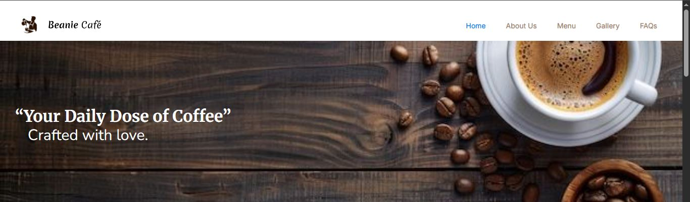
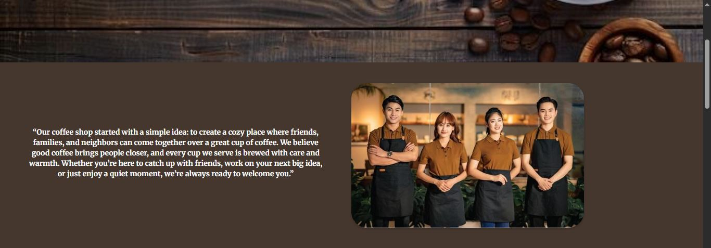
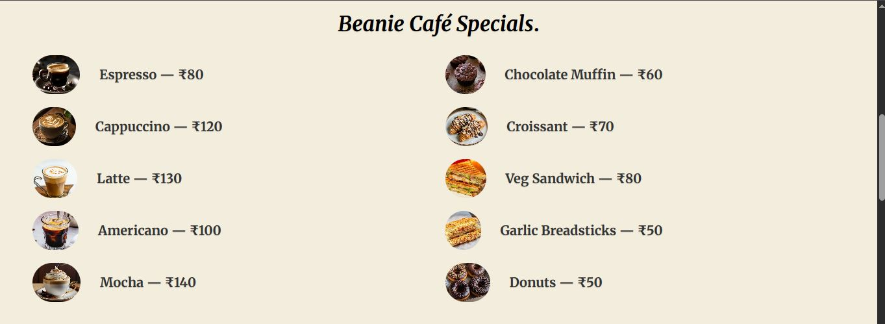
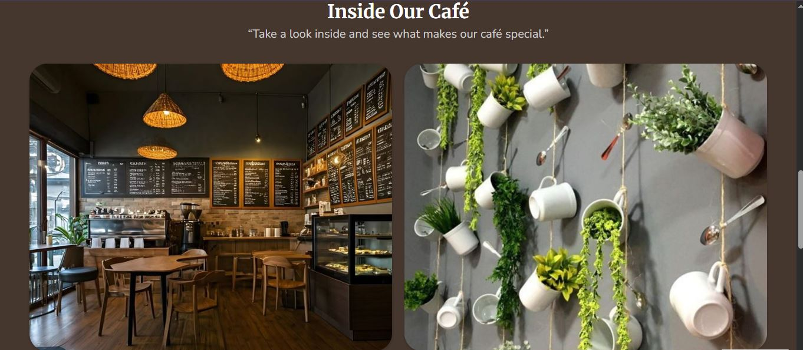
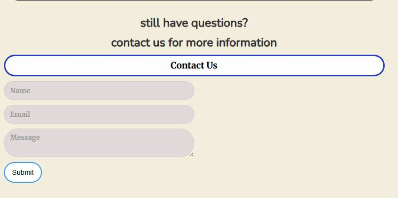

# Beanie Café ☕✨

**Beanie Café** is a modern, responsive single-page coffee shop website designed in **Figma** and built in **Webflow**.

---

## 📌 About

This website is part of my diploma project to practice web design, interaction, and responsive layouts.

**Features include:**
- Hero section with an attractive image and text
- Menu section with drinks and snacks
- Gallery section
- FAQ section with interactive dropdowns
- Contact form that shows/hides on click
- Fully responsive for mobile, tablet, and desktop

---

## 🌐 Live Website

👉 [Visit Beanie Café](https://dhruvis-marvelous-site-4e8c0b.webflow.io/)

---

## 🛠️ Built With

- Figma (wireframe & design)
- Webflow (build, interactions, hosting)
- HTML & CSS (export possible for static hosting)

---

## 📸 Screenshots

